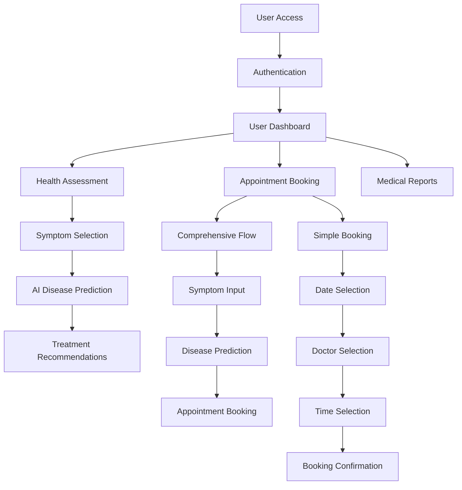
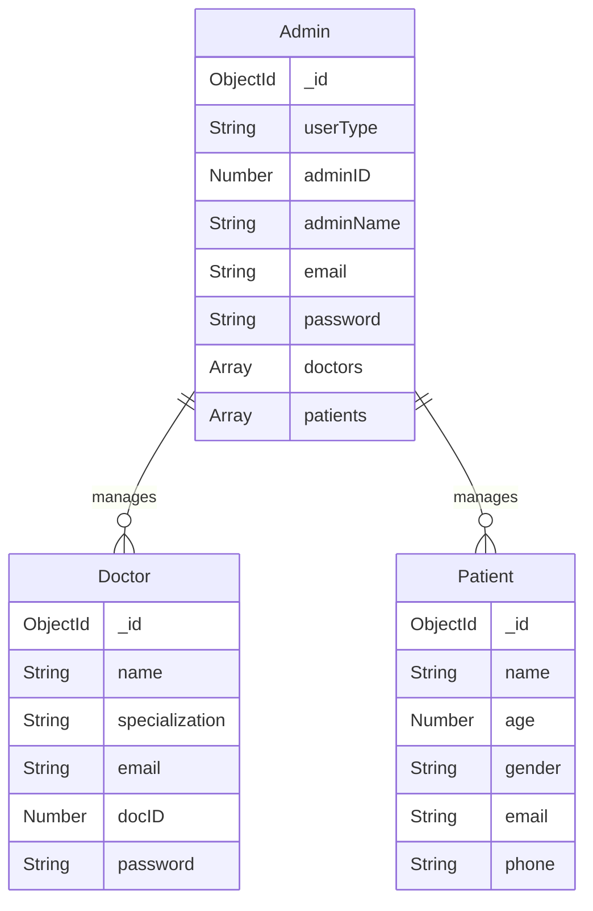
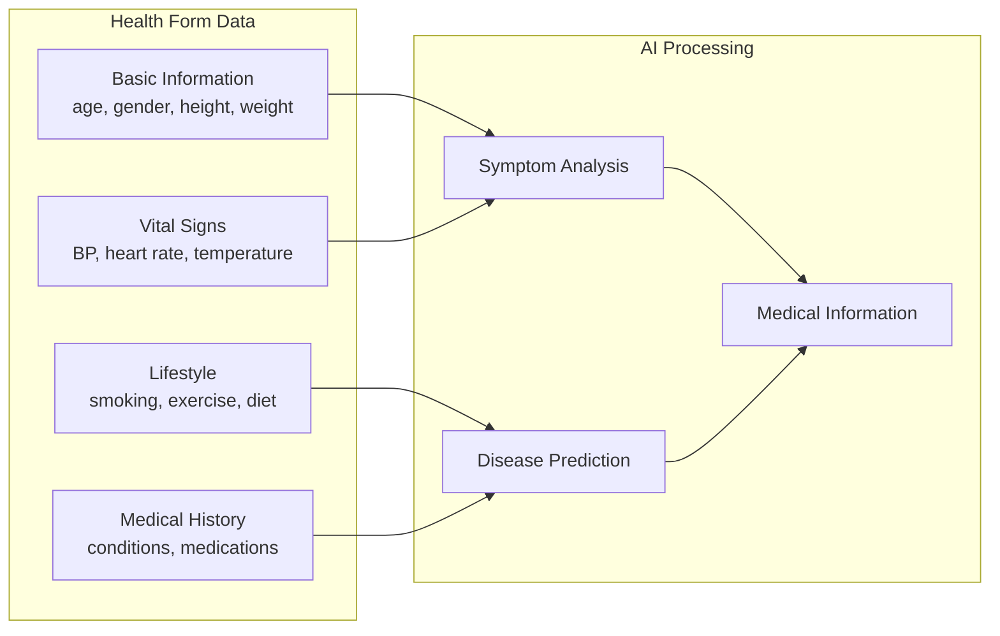

# CliniGuard 🏥

<div align="center">
  
  
  =14.0.0">
  
</div>

<div align="center">
  <h3>AI-Powered Healthcare Management Platform</h3>
  <p>A modern solution for streamlined clinic operations and enhanced patient care</p>
</div>

## 📋 Table of Contents

- [Overview](#overview)
- [Features](#features)
- [Technology Stack](#technology-stack)
- [System Architecture](#system-architecture)
- [Installation](#installation)
- [Environment Setup](#environment-setup)
- [API Documentation](#api-documentation)
- [Screenshots](#screenshots)
- [Contributing](#contributing)
- [License](#license)
- [Author](#author)

## 🔍 Overview

CliniGuard is a comprehensive web-based healthcare platform designed to revolutionize clinic operations and enhance patient care through AI-powered medical services. The platform seamlessly integrates symptom analysis, disease prediction, appointment management, and telemedicine capabilities to provide a complete healthcare solution for both patients and healthcare providers.

By leveraging advanced AI technologies, CliniGuard offers intelligent symptom assessment and disease prediction, helping patients understand their health concerns before consulting with healthcare professionals. The platform also facilitates efficient appointment scheduling and management, ensuring optimal resource utilization for healthcare facilities.

## ✨ Features

### 🔬 AI-Powered Health Assessment
- **Intelligent Symptom Analysis**: Interactive symptom selection interface with AI-powered analysis
- **Advanced Disease Prediction**: Machine learning-based disease prediction using comprehensive patient data
- **Multi-Step Health Forms**: User-friendly health assessment with intuitive progress tracking

### 📅 Appointment Management System
- **Dual Booking Pathways**: Choose between AI-guided or direct booking options based on user preference
- **Interactive Calendar**: Dynamic date selection with real-time availability management
- **Specialized Doctor Matching**: Connect patients with healthcare providers based on specialization
- **Priority Booking**: Expedited access for urgent care needs

### 🏥 Healthcare Provider Management
- **Comprehensive Doctor Profiles**: Detailed healthcare provider information management
- **Multi-Role Administration**: Role-based access control for system administrators
- **Secure Patient Records**: HIPAA-compliant patient data management system

### 🎥 Telemedicine Support
- **Secure Video Consultations**: End-to-end encrypted remote healthcare consultations
- **Real-Time Communication**: Low-latency communication system for optimal telehealth experience

## 💻 Technology Stack

| Category | Technologies |
|----------|--------------|
| **Frontend** | React.js, Tailwind CSS, Framer Motion |
| **Backend** | Node.js, Express.js |
| **Database** | MongoDB |
| **Authentication** | JWT |
| **Real-time Communication** | WebSockets |
| **AI Services** | Priaid API, Google Gemini |
| **Deployment** | Docker, Nginx |

## 🏗️ System Architecture



## Data Models

### User Management


### Health Assessment Data Flow


## Setup Instructions

### Prerequisites
- Node.js (v14 or higher)
- MongoDB
- npm or yarn package manager

### Installation

1. **Clone the repository**

2. **Install dependencies**
   ```bash
   npm install
   ``` [13](#0-12) 

3. **Environment Configuration**
   Create `.env` file with required API keys and database configuration

4. **Run the application**
   ```bash
   npm run dev
   ``` [14](#0-13) 

## API Endpoints

### Doctor Management
- `GET /doctors` - Fetch all doctors [15](#0-14) 
- `POST /doctors/register` - Register new doctor [5](#0-4) 
- `POST /doctors/login` - Doctor authentication [16](#0-15) 
- `PATCH /doctors/:doctorId` - Update doctor information [17](#0-16) 

### Reports Management
- `GET /reports` - Fetch medical reports [18](#0-17) 
- `POST /reports/create` - Create new report [19](#0-18) 
- `PATCH /reports/:reportId` - Update report [20](#0-19) 

## Component Architecture

### Frontend Components
- **Health Assessment**: Multi-step form with progress tracking
- **Appointment Booking**: Dual-flow booking system with calendar integration [21](#0-20) 
- **Symptom Analysis**: Interactive symptom selection interface
- **Dashboard**: Role-based user interfaces

### Styling System
The application uses a hybrid styling approach:
- **CSS Modules**: Component-specific styling [22](#0-21) 
- **Tailwind CSS**: Utility-first responsive design
- **Custom Design System**: Healthcare-focused color schemes and layouts


## Notes

<div align="center">
  <p>Made with ❤️ by Nupur</p>
</div>

